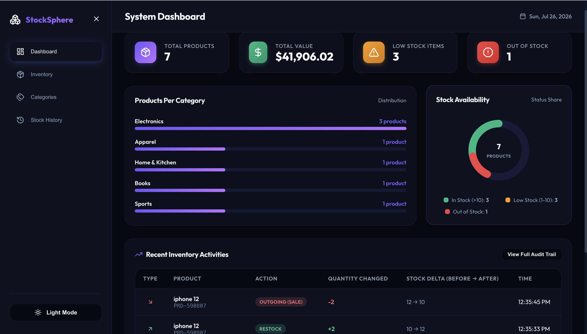

# StockSphere - Inventory Management System

A premium, frontend-only **Inventory Management System** designed to track products, manage stock levels, and view real-time inventory statistics. This application features a modern, responsive user experience utilizing Glassmorphism design aesthetics, HSL color tokens, and smooth transition animations.

---

## 🚀 Live Demo & Deployment
- **Deployment Platform**: Vercel / Netlify (Recommended)
- **Local Host URL**: `http://localhost:5173`

---

## 🛠️ Technology Stack

- **Framework**: React.js (Vite compiler for rapid development and HMR)
- **Form Handling & Validation**: **Formik + Yup** (Mandatory - validates all creation, detail updates, and stock edits)
- **Icons**: **Lucide React** (Clean, modern SVG vectors)
- **Styling**: **Vanilla CSS Custom properties** (konsolidated in `src/index.css` for absolute performance control, theme transitions, and CSS grids)
- **Data Persistence**: **localStorage** (Saves products, custom categories, stock change audit history, and dark mode state across browser reloads)

---

## ✨ Features Implemented

### 1. Core Product Management
* **Add Products**: Formik-controlled inputs validating product name, categories, positive prices, and non-negative stock counts.
* **Edit Details**: Pre-fills existing records to allow updates to names, categories, prices, or stock.
* **Delete Products**: Deletes products and files a deletion audit trail log.
* **Inline Stock Adjustments**: Quick `+` (increment by 1) and `-` (decrement by 1, safely capped at 0) buttons on rows and cards.

### 2. Stock Management (Safety Enforced)
* **Adjust Stock Levels**: Detailed Stock Modal allows incoming (restock) and outgoing (sale) transaction logging.
* **Underflow Prevention**: Outgoing sale quantity validations prevent stock values from dropping below zero.

### 3. Interactive Dashboard
* **Quick Stats Cards**: Monitors Total Products count, Total Inventory Valuation, Low Stock warnings, and Out of Stock alerts.
* **Analytics SVG Charts**:
  - **Stock Status Donut Chart**: Circular SVG chart mapping stock tiers (In Stock, Low Stock, Out of Stock) with segment indicators.
  - **Horizontal Bar Charts**: Visual progress breakdown representing product counts per category.
* **Recent Activity Log**: Summarizes the last 5 logs detailing who, what, and how stock moved.

### 4. Custom Categories
* **Custom Additions**: Unique category creator form validating uniqueness (rejects duplicate categories case-insensitively).
* **Tally Cards**: View category summaries with real-time badges indicating product counts.

### 5. Search & Filters
* **Fuzzy Search**: Filter by product name or SKU.
* **Category Filter**: Dropdown to isolate specific categories.
* **Stock Tier Filter**: Filter products by In Stock, Low Stock, or Out of Stock.
* **Interactive Sorting**: Click column headers (SKU, Name, Price, Stock) to sort list details.

### 6. Premium Bonus Features Implemented
* ✅ **Auto-Generated SKU**: Generates random unique product identifiers (e.g. `PRD-382910`) on item additions.
* ✅ **Stock History Log**: Audit logs with timestamps, action labels, deltas, and before/after states.
* ✅ **Export to CSV**: Clientside CSV builder which complies filtered products and triggers downloading.
* ✅ **Dark Mode**: Sun/Moon toggler in Sidebar. Mode settings persist to localStorage.
* ✅ **Bulk Actions**: Checkbox triggers a floating toolbar to Restock or Delete multiple selected products simultaneously.
* ✅ **Layout View Toggle**: Switch between List Table layout and responsive Grid Cards view.

---

## 💻 How to Run the Project Locally

### 1. Prerequisites
Ensure you have [Node.js](https://nodejs.org/) installed (v18 or higher recommended).

### 2. Clone the Repository
```bash
git clone <repository-url>
cd Inventory_Management
```

### 3. Install Dependencies
```bash
npm install
```

### 4. Run Development Server
```bash
npm run dev
```
Open your browser and navigate to `http://localhost:5173`.

### 5. Build for Production
Verify bundle size and build optimizations:
```bash
npm run build
npm run preview
```

### 6. Lint Check
Verify formatting quality standards:
```bash
npm run lint
```

---

## 📸 Application Layout Guide (Screenshots)

* **Dashboard View**: Overview of stats widgets, SVG stock distribution donut chart, CSS categories bars, and recent activity log.
* **Inventory (Table View)**: Core product table displaying inline +/- stock controls, search query filter, select checkboxes, and sorting headers.
* **Bulk Toolbar**: Floating bottom overlay showing selection count, Bulk Restock amount triggers, and Bulk Delete actions.
* **Add Product (Form Validations)**: Shows Formik & Yup inline validations preventing empty input, negative values, or invalid fields.
* **Detailed Stock Adjustment Modal**: Segmented selector for Incoming/Outgoing actions with limit checks preventing sales exceeding stock.
* **Categories View**: Category management screen showing custom creation form and tally counts.
* **Stock History (Audit Trail)**: Chronological list of product updates and stock shift deltas.


.png>)
.png>)


